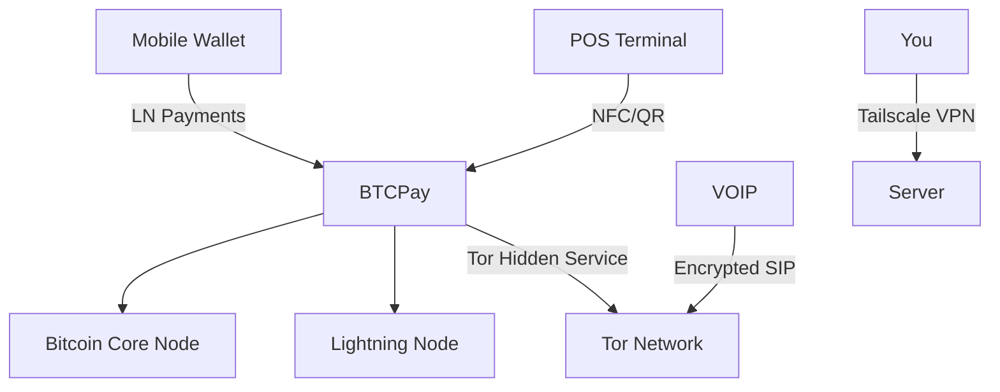
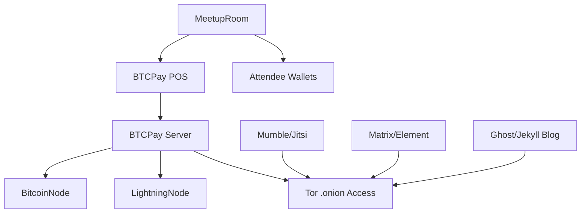
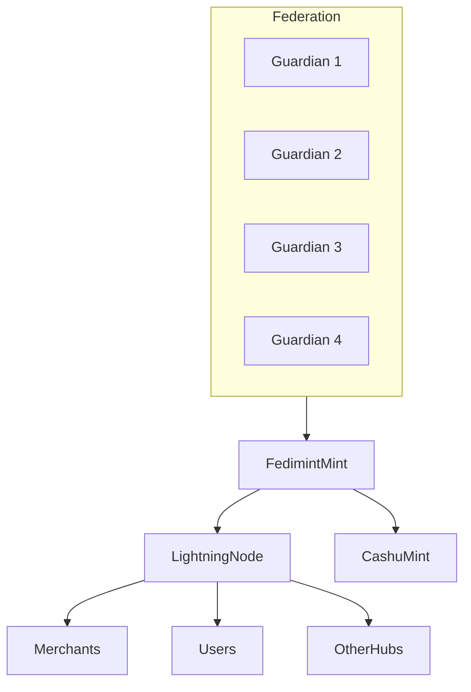

## **1. Define the Stack’s Core Goals**

A Bitcoin-ready stack should:

* Run a **full Bitcoin node** for trustless validation.
* Host apps like **BTCPay Server, Electrs, LNbits**, etc.
* Be modular and upgradeable as your needs grow.
* Be hardened against external threats.

**Budget Range:** USD \$250 – \$600 (one-time hardware).

---

## **2. Choose the Hardware**

### **Option A: Mini-PC (Best Value)**

* Example: Beelink SER5, Minisforum, Intel NUC (used/refurbished units are cheap).
* Specs:

  * **CPU:** AMD Ryzen 5 or Intel i5 (quad-core minimum)
  * **RAM:** 8–16GB
  * **Storage:** 1TB SSD (or larger for full Bitcoin node + Electrs index).
  * **Price:** \~\$250–\$400

### **Option B: Raspberry Pi 5 (Cheapest)**

* Pi 5 + SSD (1TB) + case + PSU
* Less horsepower for large Electrum indexes, but fine for Core + Lightning.
* Price: \~\$200–\$250

### **Option C: Repurpose Old PC**

* Upgrade with a 1TB SSD and 8GB+ RAM.
* Practically free if you already have one lying around.

---

## **3. Operating System Setup**

* Install **Debian or Ubuntu Server** (stable, lightweight, well-documented).
* Harden it:

  * Create non-root user.
  * Enable SSH with key-based login.
  * Install `ufw` (firewall) and block all unnecessary ports.
  * Use `fail2ban` for brute-force protection.

---

## **4. Core Bitcoin Services**

### **Bitcoin Core**

```bash
sudo apt install bitcoind
bitcoind -daemon
```

* Syncs the entire blockchain (use an external SSD if using Pi).
* Prune mode: `-prune=550` if storage is tight.

### **Electrs (Optional, for wallet privacy)**

* Allows your wallets (e.g., Sparrow, Electrum) to query your own node.

### **Lightning Node**

* Options: `lnd`, `Core Lightning (CLN)`, or `Eclair`.
* For beginners: **LND + Ride The Lightning (RTL)** web dashboard.

---

## **5. App Layer (BTCPay Server, LNbits, etc.)**

### **Use Docker for App Isolation**

```bash
sudo apt install docker docker-compose
```

**BTCPay Server (all-in-one)**

```bash
git clone https://github.com/btcpayserver/btcpayserver-docker
cd btcpayserver-docker
./btcpay-setup.sh -i
```

* Includes Bitcoin Core, Lightning, Electrum server, and merchant tools.

**LNbits**

```bash
git clone https://github.com/lnbits/lnbits
cd lnbits
docker-compose up -d
```

---

## **6. Domain + Remote Access**

* Buy a domain (\~\$2–\$10 on Namecheap or Porkbun).
* Use **Cloudflare** or DuckDNS for Dynamic DNS if your home IP changes.
* Forward ports **80 and 443** on your router to the server.
* Install **Nginx + Certbot** for free HTTPS (Let’s Encrypt).

---

## **7. Security & Backup**

* **Cold storage** for private keys (your server should be stateless if possible).
* Encrypt your SSD with **LUKS**.
* Remote backups (rsync or restic) to an encrypted external drive or cloud storage.
* Consider using **Tailscale** or **WireGuard VPN** for secure remote management.

---

## **8. Scaling Later**

* Add a second mini-PC as a **redundant node**.
* Run **multiple Lightning nodes** and balance channels.
* Deploy services like **Mempool.space** or a local **Tor hidden service** for privacy.

---

## **Sample Cost Breakdown**

| Item                    | Cost (USD) |
| ----------------------- | ---------- |
| Mini-PC (Ryzen 5, 16GB) | \$300      |
| 1TB NVMe SSD            | \$70       |
| UPS (battery backup)    | \$50       |
| Domain + DNS            | \$10/year  |
| Total                   | **\$430**  |

---

## **Why This Matters**

* You’re no longer reliant on **third-party servers**.
* Supports **self-custody** + merchant POS systems.
* You can host Bitcoin meetups and demo live infrastructure.
* Upgrades into a **community node hub** with VOIP or Tor integration later.


# **Part 2: Connecting Your Bitcoin-Ready Server with VOIP, Tor, and POS Devices**

Your Bitcoin server stack is running Bitcoin Core, Lightning, and BTCPay Server. Now we’ll integrate **communications (VOIP), privacy (Tor), and merchant-ready POS solutions**. This transforms your stack into a full community or business hub.

---

## **1. Integrating VOIP for Bitcoin Operations**

### **Why VOIP?**

* Host **private calls** for team members or meetups.
* Provide a **hotline** for customers buying Bitcoin or using your POS.
* Replace centralized tools like Zoom or WhatsApp.

### **VOIP Server Setup**

We’ll use **Asterisk** (battle-tested, open-source).

```bash
sudo apt install asterisk asterisk-sounds-main
```

### **Basic Config**

1. Edit `/etc/asterisk/sip.conf`:

   ```ini
   [general]
   context=default
   allowguest=no
   disallow=all
   allow=ulaw

   [user1]
   type=friend
   secret=yourpassword
   host=dynamic
   context=default
   ```
2. Define extensions in `/etc/asterisk/extensions.conf`:

   ```ini
   [default]
   exten => 1000,1,Dial(SIP/user1)
   ```
3. Restart Asterisk:

   ```bash
   sudo systemctl restart asterisk
   ```

**Clients:** Zoiper, Linphone, or any SIP softphone can now connect.
**Bonus:** Point VOIP traffic through your **VPN or Tor hidden service** for maximum privacy (covered below).

---

## **2. Tor Integration for Your Server Stack**

### **Why Tor?**

* Allows **censorship-resistant** access to Bitcoin services.
* Enables merchants/customers to access BTCPay Server without DNS or public IP exposure.

### **Install Tor**

```bash
sudo apt install tor
```

### **Create Hidden Services**

Edit `/etc/tor/torrc`:

```bash
HiddenServiceDir /var/lib/tor/btcpay_hidden_service/
HiddenServicePort 80 127.0.0.1:80
HiddenServicePort 443 127.0.0.1:443
```

Restart Tor:

```bash
sudo systemctl restart tor
```

Get your `.onion` address:

```bash
sudo cat /var/lib/tor/btcpay_hidden_service/hostname
```

**Now your BTCPay Server is available over Tor.**
Do the same for VOIP (`SIP` or `WebRTC`) if you want private voice services for Bitcoin meetups.

---

## **3. POS Devices & Merchant Tools**

### **Option A: BTCPay Server POS App**

* Built-in in your existing BTCPay stack.
* Access via web browser or dedicated Android app.
* Lightning or on-chain payments supported.

### **Option B: Hardware POS (e.g., M5Stack or ESP32)**

1. Install **LNbits** as an extension on your stack.
2. Deploy **PoS extension** inside LNbits:

   * Works with Lightning wallets and Bolt Cards.
   * Simple QR display and NFC tap-to-pay.

### **Option C: Self-Custody Card Terminals**

* Devices like **SatsCard (Coinkite)** or **Bolt Card** integrated with LNbits.
* Merchant simply taps cards for instant settlement.

---

## **4. Tie Everything Together**

### **VPN Layer (Optional)**

* Install **Tailscale** or **WireGuard** for encrypted access to VOIP, POS management, and Bitcoin node.

### **Meetup Hub**

* Host **Mumble (voice)** or **Jitsi (video)** on the same stack.
* Share your Tor address for participants.
* Showcase your Bitcoin node and POS system live at meetups.

---

## **5. Scaling the Network**

* Run **multiple POS terminals** across your community; they connect back to your Lightning node.
* Add **matrix.org (Synapse)** for chat and Bitcoin community coordination.
* Deploy **Tor bridges** to help others in censored areas connect.

---

## **Sample Setup Diagram (Markdown for Jekyll)**



---

## **6. Future Add-ons**

* Add **SMS gateways** (Gammu) for Bitcoin notifications.
* Build a **local mesh network (Meshtastic)** for offline meetups.
* Integrate **Point-of-Sale analytics** with Grafana dashboards.

---

### **Cost to Add These Features**

| Feature                       | Cost (USD)             |
| ----------------------------- | ---------------------- |
| VOIP (Asterisk)               | Free (existing server) |
| Tor Hidden Service            | Free                   |
| POS (BTCPay App)              | Free                   |
| Hardware POS (ESP32 terminal) | \$35–\$50              |
| NFC Bolt Cards (Coinkite)     | \$10 each              |

---

# **Part 3: Building Bitcoin Meetups & Community Hubs with Your Server Stack**

Your Bitcoin-ready server stack is now a powerhouse: Bitcoin Core, Lightning, BTCPay Server, Tor, VOIP, and POS. Now, let's **turn it into a community hub** that educates, connects, and onboards people into Bitcoin.

This is where **local impact meets technical sovereignty.**

---

## **1. Why Community Hubs?**

* **Build trust:** People adopt Bitcoin faster when they have face-to-face guidance.
* **Create local liquidity:** Meetups become P2P exchanges.
* **Train merchants:** Hands-on demos of POS systems boost adoption.
* **Resist censorship:** Your hub can coordinate via Tor, VOIP, and self-hosted tools.

---

## **2. Host Bitcoin Meetups (Online + Offline)**

### **Offline: Physical Meetups**

1. **Venue:** Library, café, co-working space, church halls, or even your home base.
2. **Gear:**

   * Raspberry Pi projector setup for demos.
   * POS terminals ready to show Lightning payments live.
   * NFC Bolt Cards + test wallets.
3. **Activities:**

   * "Scan-to-Pay" demo (1,000 sats giveaway to attendees).
   * Live VOIP call with Bitcoiners from another hub.
   * Mini-hackathons: wallet backups, seed phrase practice, etc.

### **Online: Virtual Participation**

* Use **Mumble (voice)** or **Jitsi (video)** on your server.
* Publish your **Tor hidden service** or Tailscale link so people can join securely.

---

## **3. Community Hub Tools (Self-Hosted)**

Your stack can host **everything your meetup needs**:

### **A. VOIP & Chat**

* **Mumble** (voice) or **Matrix/Synapse** (chat + rooms).
* Connect both with Tor hidden services for global privacy.

### **B. Education Portals**

* Add a **Jekyll or Ghost blog** with Bitcoin guides.
* Host open-source e-learning (Moodle or Canvas LMS).

### **C. Merchant Training**

* Run BTCPay Server in **test mode**. Let merchants try POS terminals without risk.

### **D. Local Directory**

* Build a **Bitcoin-friendly business directory** (using open-source CMS like Directus or Wiki.js).

---

## **4. Integrating POS & P2P Exchange at Meetups**

### **POS Demos**

* Bring **BTCPay POS web app** on a tablet/phone.
* Show **LNbits Bolt Card terminals** (tap-to-pay).
* Sell drinks/snacks in sats (make it real).

### **P2P Exchange Setup**

* Use your **Lightning node as escrow** (LNbits has this feature).
* Train attendees on how to swap fiat ↔ Bitcoin with **low fees & privacy**.
* Integrate **Mostro** or **Robosats** for decentralized orderbooks.

---

## **5. Educational Flow: “From Zero to Self-Custody”**

Your meetup should **teach Bitcoin in a logical order**:

1. **Intro talk:** Why Bitcoin matters locally.
2. **Wallet setup:** Phoenix, Muun, or Breez wallet (self-custody).
3. **Live transaction:** Give everyone 500–1,000 sats.
4. **POS demo:** Show how merchants can accept sats instantly.
5. **Node & Tor:** Explain how your hub’s infrastructure powers censorship resistance.

> **Pro tip:** Record sessions and host them on your server (or Peertube) for future viewing.

---

## **6. Community Security & Privacy**

* **Tor-only access** for online participation.
* Encourage everyone to use **Nostr** for communications.
* Offer a **Bitcoin backup clinic** at meetups (metal seed stamping).

---

## **7. Growth Strategy**

* Start with a **core group** (5–10 attendees).
* Host **monthly or biweekly**.
* Each event:

  * 1 technical talk (e.g., Lightning privacy).
  * 1 practical demo (POS, cold storage).
  * 1 community-building exercise (merchants signup).

### **Scaling Up**

* Replicate hubs in other towns using the same stack.
* Interconnect via **VOIP bridges + Nostr relays**.
* Build a **liquidity federation** using **Fedimint** (optional advanced step).

---

## **8. Sample Community Hub Topology**



---

## **9. Advanced Educational Add-ons**

* **Run a Tor bridge**: Teach censorship resistance in action.
* **Nostr Relay:** Give attendees their first public keys & identities.
* **Meshtastic Radios:** Show how Bitcoin & chat work offline.
* **Node Workshops:** Teach attendees to spin up their own Bitcoin or Lightning nodes.

---

## **10. Cost Estimate**

| Component                  | Cost (USD)           |
| -------------------------- | -------------------- |
| BTCPay POS Web App         | Free                 |
| NFC Bolt Card Reader       | \$50                 |
| NFC Bolt Cards (10x)       | \$100                |
| Projector (used)           | \$100                |
| Mumble/Jitsi Server        | Free (on your stack) |
| Printing educational zines | \$30                 |

---

## **Action Plan for Your First Meetup**

1. Announce on **Nostr, Twitter, and local groups**.
2. Prepare POS terminals + sats giveaways.
3. Use **Mumble** for remote participants.
4. Collect merchant interest & schedule merchant-only workshop.
5. Publish recap blog post (with photos & videos).

---

# **Part 4: Building Liquidity Networks & Federated Bitcoin Custody (Fedimint, Cashu, and Beyond)**

Your server stack now powers Bitcoin nodes, Lightning, POS systems, and community hubs. The next step is **pooling liquidity and enabling federated custody**, so your network is **self-reliant and censorship-resistant**.

---

## **1. Why Build a Liquidity Network?**

* **Solve inbound liquidity issues:** Lightning channels are useless without balanced liquidity.
* **Enable rapid onboarding:** New users can instantly use Bitcoin without waiting for on-chain confirmations.
* **Provide community resilience:** Federations can custody Bitcoin for those not ready for self-custody yet.
* **Privacy layer:** Tools like Cashu (Chaumian e-cash) prevent transaction linking.

---

## **2. Core Concepts**

### **A. Federated Custody (Fedimint)**

* **Fedimint** = Federated Mint.
* Users hold Bitcoin-backed tokens, but custody is split between **trusted guardians** (your community hub leaders).
* If one guardian is compromised, funds remain secure as long as a majority remains honest.
* Integrates with Lightning for instant payments.

### **B. Chaumian Ecash (Cashu)**

* Works like digital cash: users hold **blinded tokens** redeemable for Bitcoin.
* The mint (your server) doesn’t know who owns which tokens.
* Perfect for **private microtransactions** at meetups or local markets.

### **C. Local Liquidity Pools**

* Hubs pool sats together to act as **Lightning liquidity providers**.
* This creates **always-open channels** for merchants, new users, and P2P trading.

---

## **3. Setting Up Fedimint**

### **Step 1: Install on Your Hub Server**

```bash
# Install dependencies (Ubuntu/Debian)
sudo apt update && sudo apt install -y git cargo build-essential

# Clone Fedimint
git clone https://github.com/fedimint/fedimint.git
cd fedimint

# Build binaries
cargo build --release
```

### **Step 2: Create a Federation**

* Each **guardian** (trusted community member) runs a `fedimintd` node.
* Exchange public keys with each other and agree on a threshold (e.g., 3-of-5 guardians must approve withdrawals).

### **Step 3: Fund the Mint**

* Deposit Bitcoin into the federation’s wallet.
* Mint issues **Federated Ecash tokens** redeemable for Bitcoin at any time.

### **Step 4: User Access**

* Users connect via the **Fedimint mobile wallet (Fedi)**.
* They can send/receive Lightning instantly and redeem tokens for Bitcoin.

---

## **4. Integrating Cashu for Privacy**

Cashu can run on the same server as your hub and acts as a **privacy-preserving layer**.

### **Install Cashu**

```bash
git clone https://github.com/cashubtc/nutshell.git
cd nutshell
poetry install
```

### **Run the Mint**

```bash
poetry run cashu mint
```

* Users interact with the mint using **Cashu Wallet** (desktop or mobile).
* Each token is **blindly signed**, so the mint doesn’t know who’s spending them.

---

## **5. Federations + Liquidity = Power**

### **Liquidity Responsibilities**

* Your federation’s pooled Bitcoin becomes the **backbone of Lightning liquidity**.
* Open channels to:

  * **Merchants** using your BTCPay POS.
  * **Robosats / Mostro users** trading P2P.
  * **Other hubs** in your region.

### **Rebalancing Tools**

* Use **lnbits-LNDHub** or **CLN-Tools** to automate channel rebalancing.
* Offer **Lightning Loop or Pool services** for community members.

---

## **6. Real-World Use Cases for Your Community**

1. **Onboard New Users Fast**

   * Issue **Fedimint tokens** instantly when they give you fiat.
   * They can later redeem for Bitcoin or spend directly with merchants.

2. **Merchant Stability**

   * Merchants can accept Fedimint/Cashu tokens without worrying about channels or fees.
   * Later settle to Bitcoin when they choose.

3. **Privacy-First Payments**

   * Attendees at meetups can pay anonymously using Cashu tokens.
   * Great for censorship-sensitive users.

4. **Decentralized Liquidity Network**

   * Connect multiple hubs and federations together using **Lightning + Tor**.

---

## **7. Topology: Your Federation in the Bigger Picture**



---

## **8. Governance & Security**

* **Choose guardians wisely:** They must be known, respected, and distributed geographically.
* **Set withdrawal thresholds:** 3-of-5 or 4-of-7.
* **Train guardians on backups:** Use Shamir backups for keys.
* **Set policies:**

  * When to open new channels?
  * How to handle disputes?
  * Fee structure for sustainability?

---

## **9. Cost & Sustainability**

* Guardians run **small VPS or home servers**.
* Charge **small minting and channel fees** to cover infrastructure.
* Merchants may contribute a small percentage to support the federation.

---

## **10. What’s Next?**

* **Interconnect Federations:**

  * Create bridges so users can move between Fedimint federations seamlessly.
  * Use Nostr relays for federation announcements.

* **Enable Cashu Mints inside Fedimint:**

  * Cashu tokens can be backed by your federation for **best of both worlds**: privacy + shared custody.

* **Cross-Hub Coordination:**

  * Coordinate liquidity between hubs in different regions using your VOIP + Tor network (from Part 2 and 3).

---

## **Conclusion: Your Local Bitcoin Economy**

By building **liquidity networks and federated custody**, your hub is no longer just a meetup space – it's a **local Bitcoin economy**:

* Users onboard instantly.
* Merchants accept Bitcoin without technical headaches.
* Privacy is baked in.
* Guardians maintain collective security.

This is how communities **move from adoption → resilience → independence.**

---
Here’s **Part 5**: **Building a Decentralized Marketplace & Business Ecosystem Around Your Hub**. This part ties together the first four guides and shifts the focus to long-term sustainability and real economic activity.

---

# **Part 5: Building a Decentralized Marketplace & Business Ecosystem Around Your Hub**

At this stage, your hub is more than a Bitcoin node with meetups—it's a **financial and communication backbone** for your community. The next step? Build a **marketplace economy** that runs on top of the infrastructure you’ve created.

---

## **1. Why Build a Marketplace Around Your Hub?**

* **Empower local merchants and freelancers** to thrive in Bitcoin-first ecosystems.
* **Create circular economies** so Bitcoin doesn’t just “exit to fiat.”
* **Ensure hub sustainability** by generating fees and value for everyone.
* **Promote peer-to-peer trade** free of centralized gatekeepers.

Your hub becomes the **local Bitcoin Chamber of Commerce**, and your infrastructure is the foundation.

---

## **2. Marketplace Foundations**

The marketplace is built on **three pillars**:

1. **Merchants** – local businesses accepting Bitcoin.
2. **Peer-to-Peer Trade** – users exchanging goods, services, and Bitcoin directly.
3. **Services & Infrastructure** – Lightning liquidity, education, escrow, and federated custody.

---

## **3. Merchant Integration: Plug & Play**

### **Step 1: Equip Merchants with Bitcoin POS**

* Use your **BTCPay Server** or **LNbits POS extension** from Part 1 & 2.
* Integrate **Tor for privacy** and **Fedimint/Cashu** (from Part 4) for easier onboarding.
* Provide hardware:

  * Cheap Android devices or refurbished tablets.
  * Lightning-ready card readers (e.g., Bolt Cards, NFC POS).

### **Step 2: Create Merchant Incentives**

* Offer **0% fees** at first.
* Provide **liquidity from your hub** so they never worry about channels.
* Market them at your meetups and on your hub’s directory.

---

## **4. P2P Trade: Decentralized Marketplaces**

### **Option A: Integrate Existing P2P Tools**

* **Robosats**: Tor-native, non-KYC P2P Bitcoin exchange.
* **Mostro**: Nostr-powered decentralized order book (perfect for your hub).
* **Bisq / Peach**: Desktop and mobile P2P platforms.

> **Tip:** Host your **own Robosats or Mostro instance** to control reliability and reduce censorship.

### **Option B: Build a Local Marketplace**

* Use your hub’s **website (Jekyll + Nostr)** to list:

  * Local goods & services.
  * P2P Bitcoin trades.
  * Merchant promotions.
* Accept listings in **Cashu or Fedimint tokens** to support your local economy.

---

## **5. Services for the Ecosystem**

### **A. Liquidity Services**

* Charge small fees for **Lightning channel opens** or rebalancing services.
* Lease liquidity to merchants via **LNbits Submarine Swaps** or **Loop**.

### **B. Custody & Privacy**

* Provide federated custody for new users (Fedimint).
* Offer **Cashu mints** for anyone who values privacy.

### **C. Escrow & Dispute Resolution**

* Build a simple **escrow service** for larger P2P trades:

  * Custody held by your federation guardians.
  * Disputes resolved at community level.

---

## **6. Educational Tools: Build Trust & Knowledge**

1. **Merchant Bootcamps:**

   * Show merchants how to accept Lightning and Cashu.
   * Teach them how to price goods in sats or fiat.

2. **User Workshops:**

   * Self-custody with mobile wallets (Phoenix, Mutiny, Fedi).
   * Privacy best practices (Tor, Nostr, Cashu).

3. **Developer Sessions:**

   * Hackathons using your hub’s infrastructure.
   * LNbits plugins, Nostr relays, Cashu scripts, and Fedimint modules.

> Knowledge = resilience. Every participant should be comfortable with Bitcoin basics.

---

## **7. Marketplace Governance**

### **Guardians Become Market Stewards**

* The same **guardian model from Fedimint** can oversee:

  * Marketplace rules & disputes.
  * Directory listings.
  * Treasury management (community funds).

### **Treasury Model**

* Earn revenue from:

  * Marketplace listing fees.
  * Liquidity services.
  * Educational events and memberships.
* Use funds for:

  * Hub maintenance (servers, relays, liquidity).
  * Merchant grants & marketing.
  * Emergency reserves.

---

## **8. Sustainability Flywheel**

Here’s how it all works together:

1. Merchants accept Bitcoin →
2. Users spend Bitcoin locally (instead of cashing out) →
3. Hub earns small fees on liquidity/custody/marketplace listings →
4. Hub reinvests in education + liquidity + security →
5. More merchants and users join.

**Result:** Your Bitcoin economy becomes **self-reinforcing**.

---

## **9. Scaling Beyond Your Region**

* **Federate with other hubs** (using Fedimint, Cashu, or even cross-hub Robosats/Mostro coordination).
* Build **inter-hub Lightning liquidity pools** for cross-border trade.
* Share merchant directories and educational content with other communities.

> Think **local-first**, then connect regionally and globally.

---

## **10. Practical Action Plan**

1. Launch a **merchant directory** (Jekyll site with Tor mirror).
2. Start onboarding **5–10 key merchants** with free liquidity.
3. Host a **P2P Bitcoin marketplace night** using your Robosats/Mostro instance.
4. Create a **community fund** (Fedimint + multisig) for hub sustainability.
5. Build an **educational calendar** (monthly workshops, hackathons, bootcamps).

---

## **Conclusion: Build an Economy, Not Just a Meetup**

By creating a **decentralized marketplace & business ecosystem**, your hub becomes a **living Bitcoin economy**:

* Merchants, freelancers, and users transact directly.
* Bitcoin stays in circulation instead of being sold for fiat.
* Hub revenues sustain liquidity, infrastructure, and growth.
* Your community becomes **resilient, independent, and connected** globally.

This isn’t just adoption—it’s **economic sovereignty**.

---

